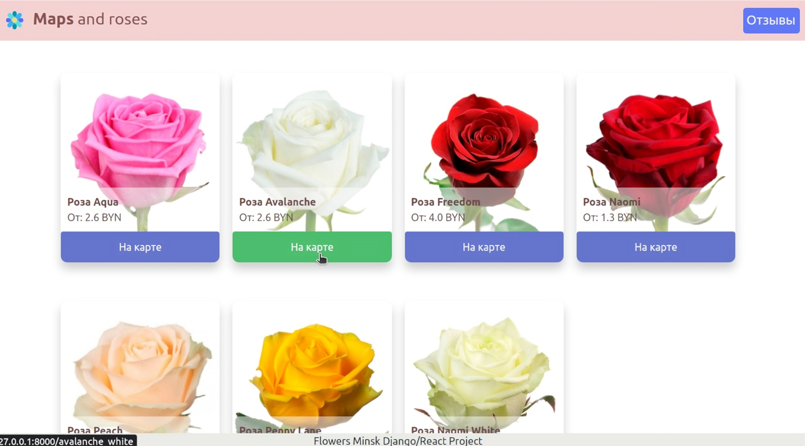
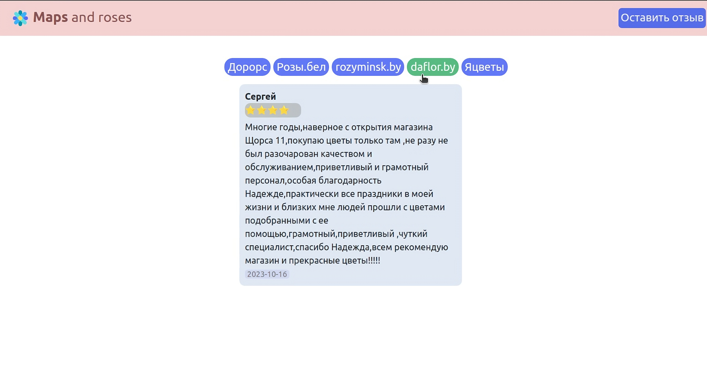
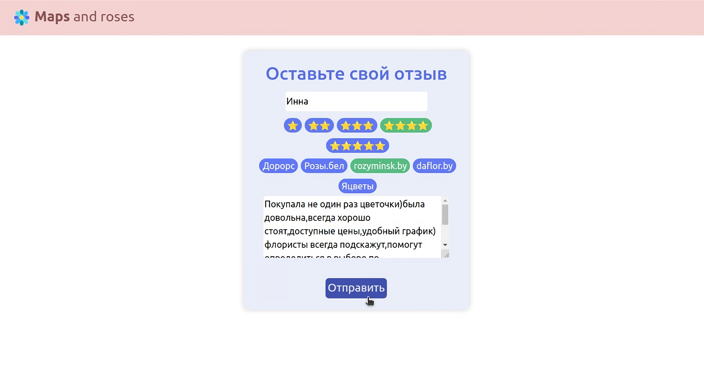

# Maps And Roses Django/React project

💬 Aggregator of prices for roses in stores in Minsk with display of trade objects with prices on an interactive map.

**📝 BS4.**
A web spcrapepr written using BS4 is used to retrieve price information from store websites.

**📘 Django Rest Framework.** 
It is used to transfer information from PostgreSQL database in Json format to frontend.

**🗺️ Folium.** 
Building an interactive map with prices plotted on it for each specific trade object. For more detailed information, popups with the address, opening hours and phone number of a particular store are added.

**🏮 React.** Displays web pages with customer reviews for stores, as well as a form to add new reviews.

## My Linkedin
📋 https://www.linkedin.com/in/uladzimir-aliakseichyk-27171328a/
